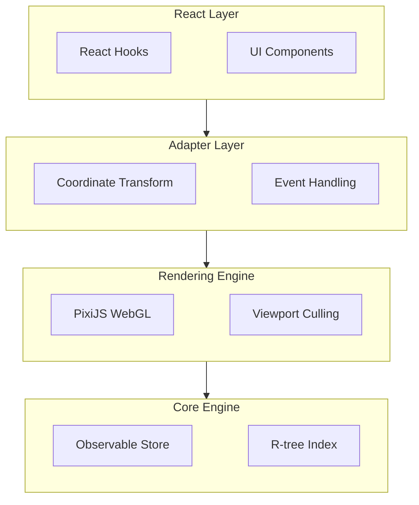

# Annota vs Annotorious

import { Callout } from 'nextra/components'

This document provides an objective comparison between Annota and Annotorious, two annotation frameworks for web-based image annotation.

## Overview

| Feature | Annota | Annotorious |
|---------|--------|-------------|
| **Primary Focus** | Digital pathology, whole slide imaging | General-purpose image annotation |
| **Rendering** | WebGL (PixiJS) | SVG |
| **Performance Target** | 10,000+ annotations at 60 FPS | Optimized for hundreds of annotations |
| **Spatial Indexing** | R-tree (O(log n) queries) | Not implemented |
| **Architecture** | 4-layer, framework-agnostic core | Coupled to W3C model |
| **Standards** | Custom model | W3C Web Annotation Data Model |
| **Maturity** | New (v0.6.0) | Mature (7+ years, v3.7.6) |
| **Community** | Small, growing | Large, established |

## Performance Comparison

### Large-Scale Annotations

**Annota**:
- WebGL rendering via PixiJS for hardware acceleration
- R-tree spatial indexing: ~13 checks for 10,000 annotations (O(log n))
- Viewport culling: Only renders visible annotations (~100 of 10,000)
- Target: 60 FPS with 10,000+ annotations

**Annotorious**:
- SVG-based rendering
- No spatial indexing (linear search)
- Optimized data model with direct coordinate values vs string parsing
- Better suited for hundreds to low thousands of annotations

### Performance Optimizations

| Optimization | Annota | Annotorious |
|--------------|--------|-------------|
| Viewport culling | ✅ Spatial query-based | ❌ Not implemented |
| Hardware acceleration | ✅ WebGL via PixiJS | ❌ SVG rendering |
| Spatial indexing | ✅ R-tree | ❌ Linear search |
| Observable updates | ✅ Granular notifications | ✅ Event-driven |
| LOD (Level of Detail) | ✅ Zoom-based simplification | ❌ Not implemented |

## Architecture

### Annota Architecture



**Key Characteristics**:
- Framework-agnostic core (pure TypeScript)
- Observable pattern for state management
- Swappable rendering backends
- Layered separation of concerns

### Annotorious Architecture

**Key Characteristics**:
- W3C Web Annotation Data Model compliance
- Event-driven architecture
- Plugin/extension system
- Performance-optimized data model (direct coordinates vs SVG strings)

## Feature Comparison

### Annotation Tools

| Tool | Annota | Annotorious |
|------|--------|-------------|
| Point | ✅ | ✅ |
| Rectangle | ✅ | ✅ |
| Polygon | ✅ | ✅ |
| Freehand | ✅ | ✅ |
| Circle | ✅ | ✅ |
| Ellipse | ✅ | ❌ |
| Push Tool (vertex editing) | ✅ | ✅ (v3.4.0+) |
| Split Tool | ✅ | ❌ |
| Merge Tool | ✅ | ❌ |
| Contour Detection | ✅ (OpenCV.js) | ❌ |

### Digital Pathology Features

| Feature | Annota | Annotorious |
|---------|--------|-------------|
| Mask polarity (positive/negative) | ✅ | ❌ |
| HDF5 loader | ✅ | ❌ |
| PGM mask format | ✅ | ❌ |
| Polygon split operations | ✅ | ❌ |
| Polygon merge operations | ✅ | ❌ |
| Multi-layer system | ✅ | Limited |
| Layer locking | ✅ | ❌ |

### Data Format Support

| Format | Annota | Annotorious |
|--------|--------|-------------|
| JSON | ✅ | ✅ |
| W3C Web Annotation | ❌ | ✅ |
| HDF5 | ✅ | ❌ |
| PGM | ✅ | ❌ |
| GeoJSON | ❌ | ❌ |
| IIIF | ❌ | ✅ |

### Viewer Integration

| Viewer | Annota | Annotorious |
|--------|--------|-------------|
| OpenSeadragon | ✅ | ✅ |
| Leaflet | ❌ | ✅ |
| Images | ✅ | ✅ |
| PDF | ❌ | ✅ |
| IIIF | ❌ | ✅ |

### React Integration

| Feature | Annota | Annotorious |
|---------|--------|-------------|
| React hooks | ✅ 20+ hooks | ✅ Basic hooks |
| Context provider | ✅ | ✅ |
| TypeScript support | ✅ Full | ✅ Full |
| React 19 support | ✅ | ✅ (v3.1.0+) |

## Technical Design Differences

### State Management

**Annota**:
- Observable pattern with granular subscriptions
- Framework-agnostic core state
- React hooks subscribe to core observables
- Separate stores for annotations, layers, history, selection

**Annotorious**:
- Event-driven state updates
- Tighter coupling to W3C model
- Performance-optimized internal representation

### Rendering Pipeline

**Annota**:
```
Store change → Spatial query (visible bounds) → Style evaluation →
PixiJS Graphics → WebGL rendering
```

**Annotorious**:
```
Store change → DOM update → SVG manipulation → Browser rendering
```

### Coordinate Systems

**Annota**:
- Three spaces: Image (stored), Viewport (OSD), Screen (events)
- Explicit coordinate transformations via adapter
- All annotations stored in image space (zoom-independent)

**Annotorious**:
- Direct coordinate values instead of SVG path strings
- Optimized for fast parsing and serialization

## Use Case Recommendations

### Choose Annota When:

- Working with **large-scale digital pathology** (10,000+ annotations)
- Need **high performance** with complex polygon operations
- Require **specialized pathology tools** (split, merge, mask polarity)
- Loading data from **HDF5 or PGM formats**
- Building **React-first** applications
- Need **framework flexibility** (potential Vue/Svelte support)

### Choose Annotorious When:

- Need **W3C Web Annotation standard** compliance
- Working with **IIIF** resources
- Require **broad viewer support** (Leaflet, PDF, images)
- Want **mature, battle-tested** solution
- Need **large community** and ecosystem
- Working with **hundreds** (not thousands) of annotations
- Require extensive **plugin system**

## Migration Considerations

### From Annotorious to Annota

**Benefits**:
- Significant performance improvement on large datasets
- Better React integration
- Specialized pathology tools

**Challenges**:
- No W3C adapter (custom data format)
- Smaller ecosystem
- OpenSeadragon-focused (limited viewer support)
- Need to rewrite data import/export

### From Annota to Annotorious

**Benefits**:
- Standards compliance (W3C)
- Broader format and viewer support
- Mature ecosystem

**Challenges**:
- Performance degradation on large datasets
- Loss of specialized pathology features
- Less React-focused architecture

## Benchmarks

### Hover Detection Performance

| Annotation Count | Annota (R-tree) | Annotorious (Linear) |
|------------------|-----------------|----------------------|
| 100 | ~0.01ms | ~0.1ms |
| 1,000 | ~0.1ms | ~1ms |
| 10,000 | ~0.1ms | ~10ms |
| 100,000 | ~0.2ms | ~100ms |

<Callout type="info">
**Note**: Benchmarks are approximate and depend on hardware, browser, and annotation complexity.
</Callout>

### Rendering Performance

| Metric | Annota (WebGL) | Annotorious (SVG) |
|--------|----------------|-------------------|
| 1,000 annotations | 60 FPS | 60 FPS |
| 5,000 annotations | 60 FPS | 30-40 FPS |
| 10,000 annotations | 60 FPS | 15-20 FPS |
| 50,000 annotations | 60 FPS (with culling) | Not recommended |

## Standards and Interoperability

### Annota

- Custom annotation data model optimized for performance
- No built-in W3C adapter (roadmap item)
- Focus on pathology-specific formats (HDF5, PGM)
- Requires custom import/export for standards compliance

### Annotorious

- W3C Web Annotation Data Model compliance
- W3CImageAdapter for automatic crosswalking
- IIIF support
- Better interoperability with annotation servers

## Community and Ecosystem

### Annota

- **Age**: New (2024-2025)
- **Version**: 0.6.0
- **Community**: Small, growing
- **Extensions**: Limited
- **Documentation**: Comprehensive, modern
- **Support**: GitHub issues

### Annotorious

- **Age**: Mature (7+ years)
- **Version**: 3.7.6
- **Community**: Large, established
- **Extensions**: Multiple official extensions
- **Documentation**: Extensive guides and examples
- **Support**: Active community, forums

## Future Roadmap

### Annota Priorities

- W3C Web Annotation adapter
- Additional viewer adapters (Leaflet, OpenLayers)
- More format loaders (TIFF, GeoJSON, QuPath)
- AI integration (model output import, confidence scores)
- Production validation and case studies

### Annotorious Recent Updates

- React 19 support (v3.1.0)
- Enhanced polygon tool with point manipulation (v3.4.0)
- Continuous performance improvements
- Growing extension ecosystem

## Conclusion

**Annota** and **Annotorious** serve different needs in the annotation ecosystem:

- **Annota** excels at **high-performance digital pathology** with specialized tools and architecture optimized for 10,000+ annotations
- **Annotorious** excels at **standards compliance** and **broad compatibility** with mature ecosystem and proven stability

The choice depends on your specific requirements: performance-critical pathology workflows favor Annota, while standards-driven general annotation favors Annotorious.
