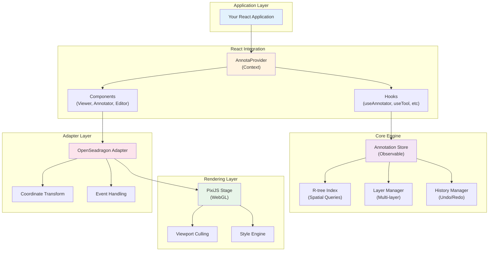
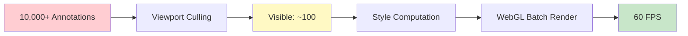
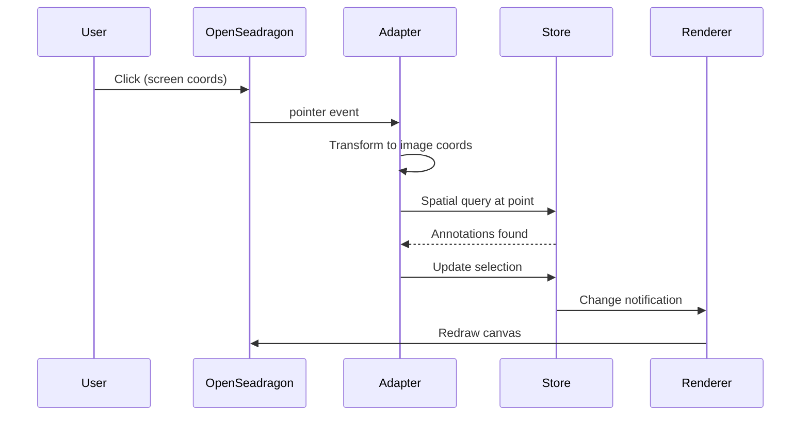
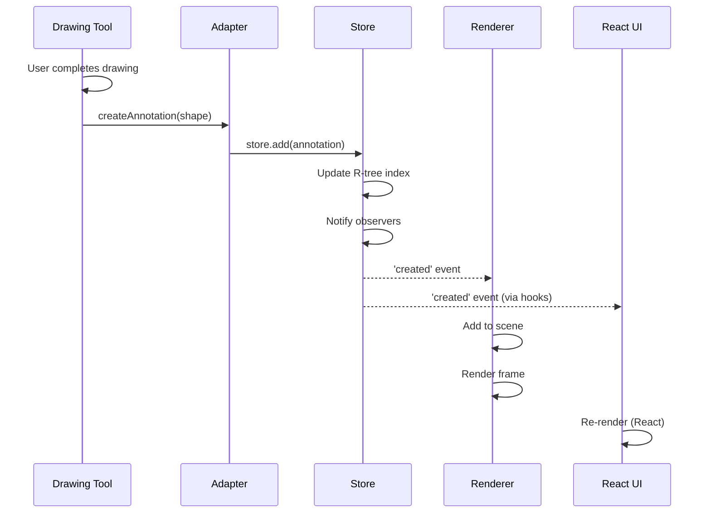
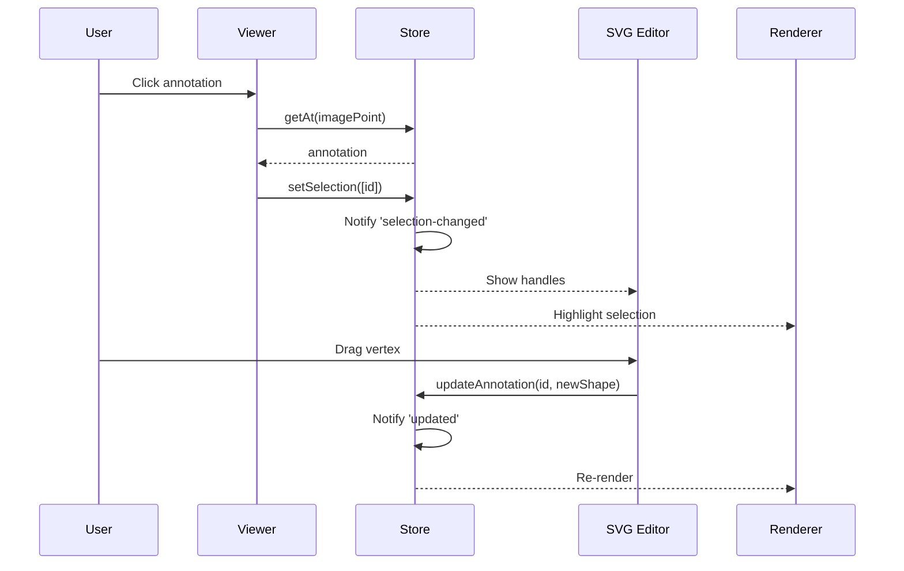
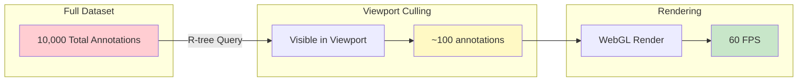

import { Callout, Steps, Tabs, Cards } from "nextra/components";
import { Layers, Cpu, GitBranch, Zap, Code2, Package } from "lucide-react";

# Architecture

Annota follows a clean, layered architecture that separates concerns and enables high-performance annotation rendering at scale.

<Callout type="info">
  **Design Philosophy**: Framework-agnostic core with thin adapter layers. The core engine works independently of React or OpenSeadragon, making it portable and testable.
</Callout>

## System Overview



## Core Principles

<Cards num={2}>
  <Cards.Card
    icon={<Layers />}
    title="Separation of Concerns"
    description="Core logic is independent from React and viewer implementations"
  />
  <Cards.Card
    icon={<Zap />}
    title="Performance First"
    description="WebGL rendering, R-tree indexing, and viewport culling for 60 FPS"
  />
  <Cards.Card
    icon={<GitBranch />}
    title="Observable Pattern"
    description="Reactive state management with granular change notifications"
  />
  <Cards.Card
    icon={<Code2 />}
    title="Type Safety"
    description="Full TypeScript coverage with strict null checks"
  />
</Cards>

## Layer Breakdown

### 1. Core Engine Layer

The **framework-agnostic** foundation that handles all annotation logic.

**Key Components:**

- **Annotation Store** (`src/core/store.ts`)
  - Single source of truth for annotations
  - Observable pattern for reactive updates
  - CRUD operations: `add`, `update`, `delete`, `get`

- **Spatial Index** (`src/core/spatial.ts`)
  - R-tree based spatial indexing
  - O(log n) queries: `getAt`, `getIntersecting`
  - Efficient bounding box calculations

- **Layer Manager** (`src/core/layer.ts`)
  - Multi-layer organization
  - Per-layer visibility, opacity, filters
  - Z-index management

- **History Manager** (`src/core/history.ts`)
  - Command pattern for undo/redo
  - Batch operations support
  - State snapshots

```typescript
// Example: Core store usage (framework-agnostic)
import { createAnnotationStore } from 'annota/core';

const store = createAnnotationStore();

// Subscribe to changes
store.observe((event) => {
  console.log(event.type); // 'created' | 'updated' | 'deleted'
});

// Add annotation
store.add({
  id: 'ann1',
  shape: { type: 'rectangle', x: 100, y: 100, width: 50, height: 50 },
});

// Spatial queries
const annotations = store.getIntersecting({
  minX: 90, minY: 90, maxX: 120, maxY: 120
});
```

<Callout>
  The core engine has **zero dependencies** on React or OpenSeadragon, making it portable to other frameworks and viewers.
</Callout>

### 2. Rendering Layer

High-performance **WebGL rendering** using PixiJS v8.

**Optimizations:**



**Features:**

- **Viewport Culling**: Only render annotations in view
- **Batch Rendering**: Single WebGL draw call per frame
- **Dynamic Styling**: Expression-based styles with hover/selection states
- **Level of Detail**: Simplify geometry at lower zoom levels

**Code Location:** `src/rendering/pixi/`

```typescript
// Dynamic styling example
const style = (annotation: Annotation) => ({
  fill: annotation.properties?.category === 'tumor' ? '#ff0000' : '#00ff00',
  fillOpacity: annotation.hover ? 0.8 : 0.4,
  strokeWidth: annotation.selected ? 3 : 1,
});
```

### 3. Adapter Layer

**Bridges** the core engine with OpenSeadragon viewer.

**Responsibilities:**

- Coordinate transformations (image ↔ viewport ↔ screen)
- Event handling (mouse, touch, keyboard)
- Canvas lifecycle management
- Viewport synchronization



**Code Location:** `src/adapters/openseadragon/`

### 4. React Integration Layer

**Thin wrapper** providing React-friendly hooks and components.

**Components:**

- `<AnnotaProvider>` - Context provider
- `<AnnotaViewer>` - OpenSeadragon viewer wrapper
- `<Annotator>` - Annotation orchestrator
- `<AnnotationEditor>` - Interactive editing overlay

**Hooks (20+):**

| Category | Hooks |
|----------|-------|
| **Core Access** | `useAnnotator()`, `useViewer()` |
| **Annotations** | `useAnnotations()`, `useAnnotation()`, `useAnnotationsAt()` |
| **Tools** | `useTool()`, `useActiveTool()`, `usePointTool()` |
| **Selection** | `useSelection()`, `useHover()` |
| **Layers** | `useLayers()`, `useLayer()` |
| **History** | `useHistory()`, `useCanUndo()`, `useCanRedo()` |
| **Editing** | `useEditing()`, `useVertexEditing()` |

<Callout type="warning">
  React components **do not** contain annotation logic - they're pure bridges to the core engine. This keeps the React layer thin and testable.
</Callout>

**Code Location:** `src/react/`

## Data Flow

### Annotation Creation Flow



### Selection & Editing Flow



## Performance Architecture

### Spatial Indexing (R-tree)

```mermaid
graph TB
    subgraph "Annotation Collection (10,000+)"
        A1[Group 1<br/>1000 annotations]
        A2[Group 2<br/>1000 annotations]
        A3[Group 3<br/>1000 annotations]
        A4[Group N<br/>7000 annotations]
    end

    subgraph "R-tree Index"
        Root[Root Node]
        Branch1[Branch 1]
        Branch2[Branch 2]
        Leaf1[Leaf 1<br/>50 items]
        Leaf2[Leaf 2<br/>50 items]
    end

    Query[Spatial Query<br/>getAt(x,y)]

    A1 --> Root
    A2 --> Root
    A3 --> Root
    A4 --> Root

    Root --> Branch1
    Root --> Branch2
    Branch1 --> Leaf1
    Branch2 --> Leaf2

    Query --> Root
    Root -.O(log n).-> Leaf1
    Leaf1 -.50 items.-> Result[Result<br/>2 annotations]

    style Query fill:#e3f2fd
    style Result fill:#c8e6c9
```

**Query Complexity:**
- **Without index**: O(n) - check all 10,000 annotations
- **With R-tree**: O(log n) - check ~50 annotations

### Viewport Culling



## Code Organization

```
src/
├── core/                  # Framework-agnostic core
│   ├── types.ts          # TypeScript types
│   ├── store.ts          # Observable annotation store
│   ├── spatial.ts        # R-tree spatial index
│   ├── layer.ts          # Layer manager
│   ├── history.ts        # Undo/redo with commands
│   └── shortcuts.ts      # Keyboard shortcuts
│
├── rendering/            # Rendering engine
│   └── pixi/
│       ├── stage.ts      # PixiJS stage manager
│       ├── shapes.ts     # Shape renderers
│       └── styles.ts     # Style computation
│
├── adapters/             # Viewer adapters
│   └── openseadragon/
│       ├── annotator.ts  # Main annotator class
│       ├── adapter.ts    # OSD adapter factory
│       └── coordinates.ts # Coordinate transforms
│
├── tools/                # Drawing tools
│   ├── base.ts          # BaseTool class
│   ├── point.ts         # PointTool
│   ├── rectangle.ts     # RectangleTool
│   ├── polygon.ts       # PolygonTool
│   ├── push.ts          # PushTool (vertex manipulation)
│   └── contour.ts       # ContourTool (OpenCV)
│
├── react/                # React integration
│   ├── Provider.tsx      # AnnotaProvider
│   ├── Viewer.tsx        # AnnotaViewer
│   ├── Annotator.tsx     # Annotator orchestrator
│   ├── Editor.tsx        # SVG editor overlay
│   ├── Popup.tsx         # Annotation popups
│   ├── ContextMenu.tsx   # Right-click menu
│   ├── hooks/            # 20+ React hooks
│   └── editors/          # Shape editors
│       ├── Point.tsx
│       ├── Rectangle.tsx
│       └── Polygon.tsx
│
├── loaders/              # Data loaders
│   ├── h5.ts            # HDF5 file loader
│   ├── h5-coordinates.ts # H5 coordinate loader
│   ├── pgm.ts           # PGM mask loader
│   ├── masks.ts         # PNG mask loader
│   └── json.ts          # JSON loader
│
├── extensions/           # Optional extensions
│   └── opencv.ts        # OpenCV.js integration
│
└── index.ts             # Public API exports
```

## Type System

### Core Types

```typescript
// Annotation structure
interface Annotation {
  id: string;
  shape: Shape;
  properties?: Record<string, any>;
  style?: AnnotationStyle;
  maskPolarity?: 'positive' | 'negative';
}

// Shape types
type Shape =
  | PointShape
  | RectangleShape
  | CircleShape
  | PolygonShape
  | MultiPolygonShape
  | FreehandShape;

// Styling
interface AnnotationStyle {
  fill?: string;
  fillOpacity?: number;
  stroke?: string;
  strokeWidth?: number;
  strokeOpacity?: number;
}

// Dynamic styling
type StyleExpression = (
  annotation: Annotation,
  state?: { hover?: boolean; selected?: boolean }
) => AnnotationStyle;
```

## Extension Points

Annota is designed to be extended:

<Steps>

### Custom Loaders

Implement loaders for new annotation formats:

```typescript
export async function loadCustomFormat(url: string): Promise<Annotation[]> {
  const response = await fetch(url);
  const data = await response.json();

  return data.map(item => ({
    id: item.id,
    shape: convertToShape(item),
    properties: item.metadata,
  }));
}
```

### Custom Tools

Extend `BaseTool` for new drawing tools:

```typescript
class CustomTool extends BaseTool {
  onPointerDown(e: PointerEvent) { /* ... */ }
  onPointerMove(e: PointerEvent) { /* ... */ }
  onPointerUp(e: PointerEvent) { /* ... */ }
}
```

### Custom Renderers

Replace PixiJS with Canvas2D or SVG if needed.

### Custom Adapters

Support other viewers (Leaflet, MapLibre, etc.) by implementing the adapter interface.

</Steps>

## Design Decisions

<Callout type="info">
  **Why separate core from React?**

  - Enables server-side processing
  - Makes testing easier
  - Allows non-React integrations
  - Reduces bundle size for core-only usage
</Callout>

<Callout type="info">
  **Why PixiJS over Canvas2D?**

  - WebGL hardware acceleration
  - Batch rendering optimization
  - Built-in scene graph
  - Better performance at scale (10,000+ annotations)
</Callout>

<Callout type="info">
  **Why OpenSeadragon?**

  - Industry standard for medical imaging
  - Deep zoom capability for gigapixel images
  - Tile-based rendering
  - Extensive ecosystem
</Callout>

## Performance Benchmarks

| Metric | Value | Description |
|--------|-------|-------------|
| **Annotations** | 10,000+ | Tested with 10,000+ simultaneous annotations |
| **Frame Rate** | 60 FPS | Maintains 60 FPS during pan/zoom |
| **Query Time** | < 1ms | Spatial queries via R-tree |
| **Memory** | ~50 MB | For 10,000 polygon annotations |
| **Initial Load** | ~200ms | From data to first render |

## Learn More

<Cards>
  <Cards.Card
    title="Getting Started"
    href="/docs/getting-started"
    description="Install and create your first annotation viewer"
  />
  <Cards.Card
    title="API Reference"
    href="/api"
    description="Explore hooks, components, and types"
  />
  <Cards.Card
    title="Guides"
    href="/docs/guides"
    description="In-depth guides for tools, layers, and styling"
  />
</Cards>
