# Architecture

import { Callout } from 'nextra/components'
import { Steps } from 'nextra/components'
import { Tabs } from 'nextra/components'

Annota is a high-performance React annotation framework for digital pathology and whole slide imaging, designed to handle 10,000+ annotations at 60 FPS.

<Callout type="info">
**Key Innovation**: Annota separates framework-agnostic core logic from UI concerns, enabling use across different viewers and frameworks.
</Callout>

## Design Principles

<Steps>

### Separation of Concerns
Core annotation logic is independent of React and viewer implementations, enabling maximum reusability.

### Framework-Agnostic Core
The core engine works without React, allowing integration with vanilla JS, Vue, Svelte, or other frameworks.

### Type Safety
Full TypeScript with strict null checks ensures reliability and excellent developer experience.

### Performance First
WebGL rendering via PixiJS, R-tree spatial indexing, and viewport culling enable handling massive annotation datasets.

### Observable Pattern
Reactive state management allows efficient granular updates without re-rendering entire datasets.

</Steps>

## High-Level Architecture

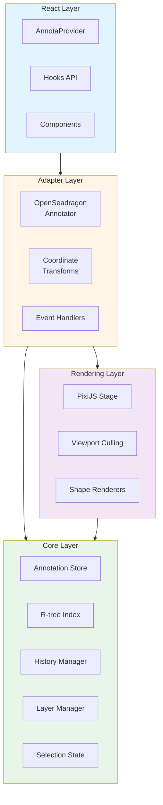

## Architecture Layers

### Layer Responsibilities

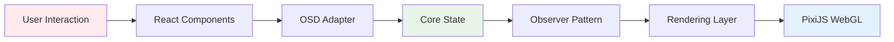

<Tabs items={['React Layer', 'Adapter Layer', 'Rendering Layer', 'Core Layer']}>
  <Tabs.Tab>
    **React Layer** - User-facing API

    - `AnnotaProvider`: Context provider for dependency injection
    - **Hooks**: 20+ hooks for annotations, selection, tools, layers, history
    - **Components**: `AnnotaViewer`, `Annotator`, `AnnotationPopup`, `ContextMenu`
    - **Editors**: Shape-specific editors (PointEditor, RectangleEditor, PolygonEditor)

    The React layer is intentionally thin - it doesn't implement annotation logic, just provides React-friendly bindings.
  </Tabs.Tab>

  <Tabs.Tab>
    **Adapter Layer** - Viewer Integration

    - `OpenSeadragonAnnotator`: Main orchestrator class
    - **Coordinate transforms**: Image ↔ Viewport ↔ Screen space
    - **Event handling**: Mouse/touch events from OSD
    - **Lifecycle management**: Canvas creation, cleanup
    - **Hit detection**: Spatial queries for hover/click

    Adapters bridge the gap between viewer frameworks and the core engine.
  </Tabs.Tab>

  <Tabs.Tab>
    **Rendering Layer** - High-Performance Display

    - `PixiStage`: WebGL rendering via PixiJS v8
    - **Viewport culling**: Only render visible annotations
    - **Shape renderers**: Optimized per-shape-type rendering
    - **Style computation**: Evaluates static and dynamic styles
    - **Level-of-detail**: Simplification at low zoom levels

    Designed to handle 10,000+ annotations at 60 FPS.
  </Tabs.Tab>

  <Tabs.Tab>
    **Core Layer** - Framework-Agnostic Logic

    - `AnnotationStore`: CRUD operations with spatial indexing
    - `LayerManager`: Multi-layer support with visibility/opacity/locking
    - `History`: Undo/redo with command pattern
    - `SelectionManager`: Multi-selection state
    - `R-tree`: Spatial index for O(log n) queries

    All core logic is pure TypeScript with no framework dependencies.
  </Tabs.Tab>
</Tabs>

## Package Structure

```
lib/annota/
├── src/
│   ├── core/                    # Framework-agnostic core
│   │   ├── types.ts            # Annotation shapes & interfaces
│   │   ├── store.ts            # Observable annotation store
│   │   ├── spatial.ts          # R-tree spatial indexing
│   │   ├── layer.ts            # Multi-layer management
│   │   ├── history.ts          # Undo/redo command pattern
│   │   ├── selection.ts        # Selection state management
│   │   └── operations.ts       # Split/merge operations
│   │
│   ├── rendering/              # Rendering layer
│   │   └── pixi/
│   │       ├── stage.ts        # PixiJS stage lifecycle
│   │       ├── shapes.ts       # Shape-specific renderers
│   │       ├── styles.ts       # Style expression evaluation
│   │       └── culling.ts      # Viewport culling logic
│   │
│   ├── adapters/               # Viewer adapters
│   │   └── openseadragon/
│   │       ├── annotator.ts   # Main OSD annotator factory
│   │       ├── adapter.ts     # OSD integration
│   │       └── coordinates.ts # Coordinate transformations
│   │
│   ├── tools/                  # Annotation tools
│   │   ├── base.ts            # BaseTool abstract class
│   │   ├── point.ts           # PointTool
│   │   ├── rectangle.ts       # RectangleTool
│   │   ├── polygon.ts         # PolygonTool
│   │   ├── push.ts            # PushTool (vertex editing)
│   │   ├── split.ts           # SplitTool
│   │   └── contour.ts         # ContourTool (OpenCV.js)
│   │
│   ├── loaders/                # Format loaders
│   │   ├── h5.ts              # HDF5 loader (jsfive)
│   │   ├── pgm.ts             # PGM mask loader/saver
│   │   ├── masks.ts           # Binary mask to polygon conversion
│   │   └── json.ts            # JSON loader
│   │
│   └── react/                  # React integration
│       ├── Provider.tsx       # AnnotaProvider context
│       ├── Annotator.tsx      # Annotator component
│       ├── Viewer.tsx         # AnnotaViewer (OSD wrapper)
│       ├── popup/             # Popup system
│       ├── editors/           # Shape editors
│       └── hooks/             # 20+ React hooks
```

## Data Flow

### Annotation Lifecycle

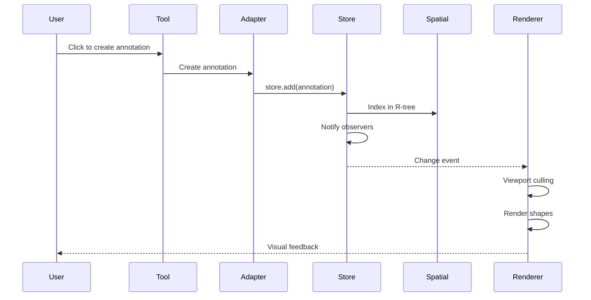

### User Interaction Flow

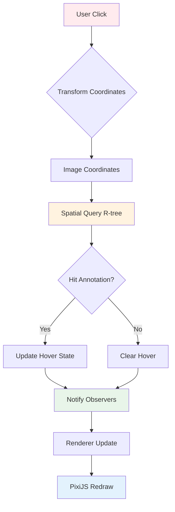

### State Management Flow

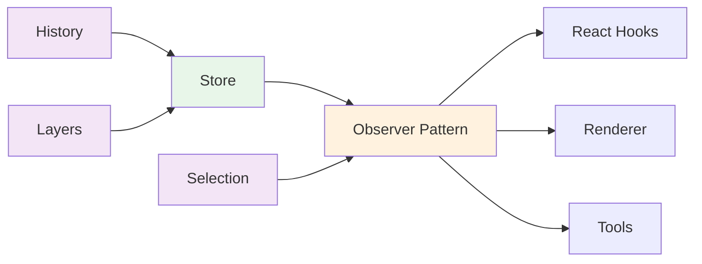

## Core Components

### 1. Annotation Store

<Callout type="info">
The store is the **single source of truth** for all annotation data, using the observable pattern for reactive updates.
</Callout>

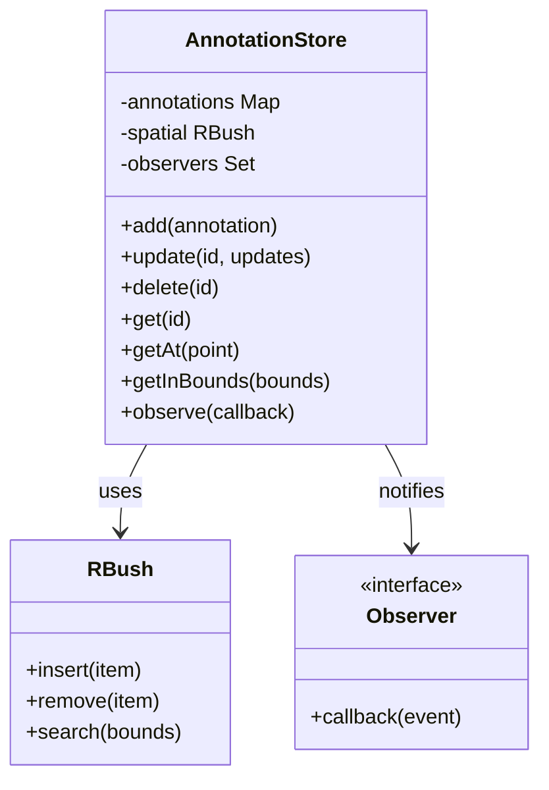

**Key Features**:
- **CRUD operations**: `add`, `update`, `delete`, `get`
- **Spatial queries**: `getAt(point)`, `getInBounds(bounds)` - O(log n) via R-tree
- **Observable**: Subscribe to changes with `observe(callback)`
- **Batch operations**: `addAll`, `updateAll`, `deleteAll` with single notification

### 2. Spatial Indexing

<Callout type="warning">
Without spatial indexing, finding annotations under cursor would be O(n). With R-tree, it's O(log n).
</Callout>

**Performance Impact**:
- 10,000 annotations: Linear search ~10,000 checks → R-tree ~13 checks
- Enables real-time hover feedback even with massive datasets

### 3. Layer System

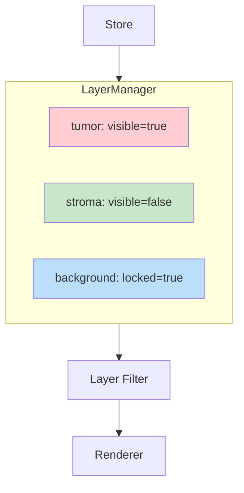

Each layer has:
- **Visibility**: Show/hide all annotations on layer
- **Opacity**: Control transparency (0-1)
- **Lock**: Prevent editing
- **Filter**: Custom filter function (e.g., mask polarity)

### 4. History System

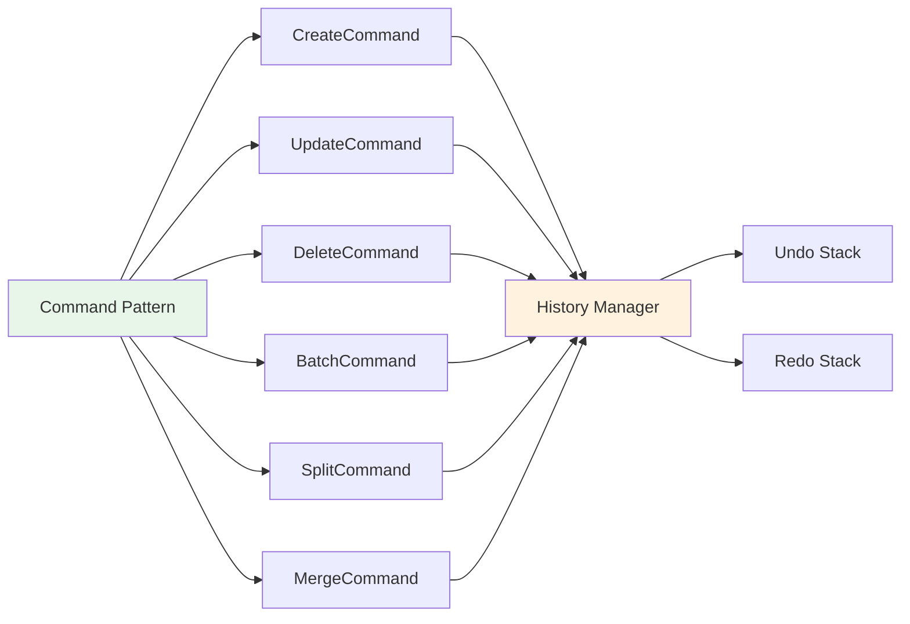

**Supports**:
- All CRUD operations
- Split/merge operations
- Batch operations (single undo step)
- Configurable history depth

## Rendering Pipeline

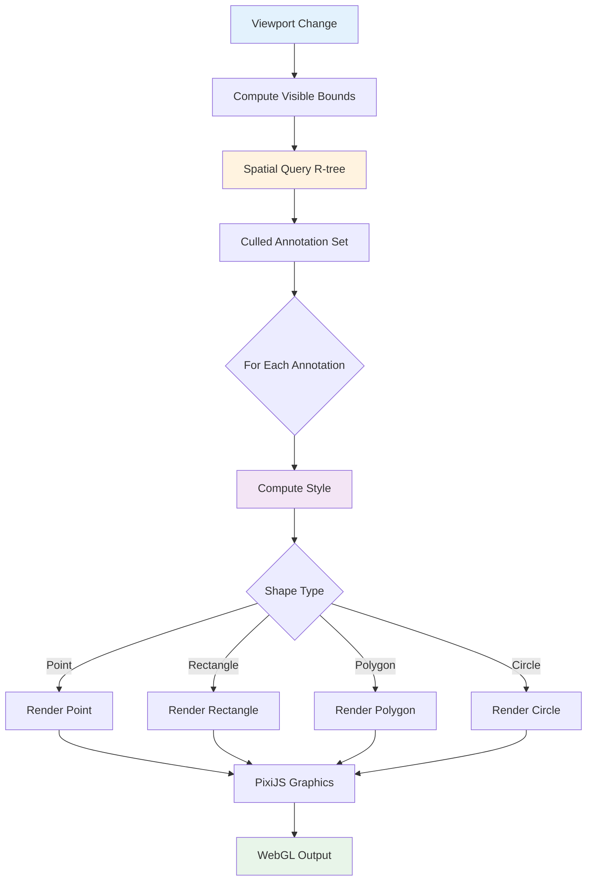

### Performance Optimizations

1. **Viewport Culling**: Only render annotations in visible area
2. **Spatial Indexing**: Fast O(log n) bounds queries
3. **WebGL Acceleration**: Hardware-accelerated rendering via PixiJS
4. **Style Caching**: Reuse computed styles when possible
5. **Debounced Updates**: Batch viewport changes

## Coordinate Systems

<Callout type="warning">
Understanding coordinate systems is critical for working with Annota and OpenSeadragon.
</Callout>

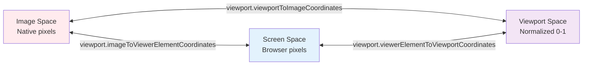

### Coordinate Spaces

<Tabs items={['Image Space', 'Viewport Space', 'Screen Space']}>
  <Tabs.Tab>
    **Image Space** - Native pixel coordinates

    - Origin: Top-left of image (0, 0)
    - Units: Image pixels
    - **This is what's stored in annotations**
    - Independent of zoom/pan

    Example: A 10,000 × 10,000 pixel image uses coordinates like (5000, 5000)
  </Tabs.Tab>

  <Tabs.Tab>
    **Viewport Space** - Normalized coordinates

    - Origin: Top-left of viewport
    - Units: Normalized (typically 0-1 range)
    - Changes with zoom/pan
    - OpenSeadragon's internal coordinate system

    Used for viewport calculations but rarely in application code.
  </Tabs.Tab>

  <Tabs.Tab>
    **Screen Space** - Browser pixel coordinates

    - Origin: Top-left of viewer container
    - Units: CSS pixels
    - Where mouse events occur
    - Must transform to image space for annotation operations

    Example: `pointerEventToImage(event)` converts click to image coordinates
  </Tabs.Tab>
</Tabs>

## Type System

### Core Annotation Types

```typescript
interface Annotation {
  id: string;                          // Unique identifier
  shape: Shape;                        // Geometry definition
  properties?: Record<string, any>;    // Custom metadata
  style?: AnnotationStyle;             // Visual appearance
  layerId?: string;                    // Layer assignment
  maskPolarity?: 'positive' | 'negative';  // For mask-based workflows
}

type Shape =
  | PointShape
  | RectangleShape
  | PolygonShape
  | MultiPolygonShape
  | CircleShape
  | EllipseShape
  | LineShape
  | FreehandShape;
```

### Shape Definitions

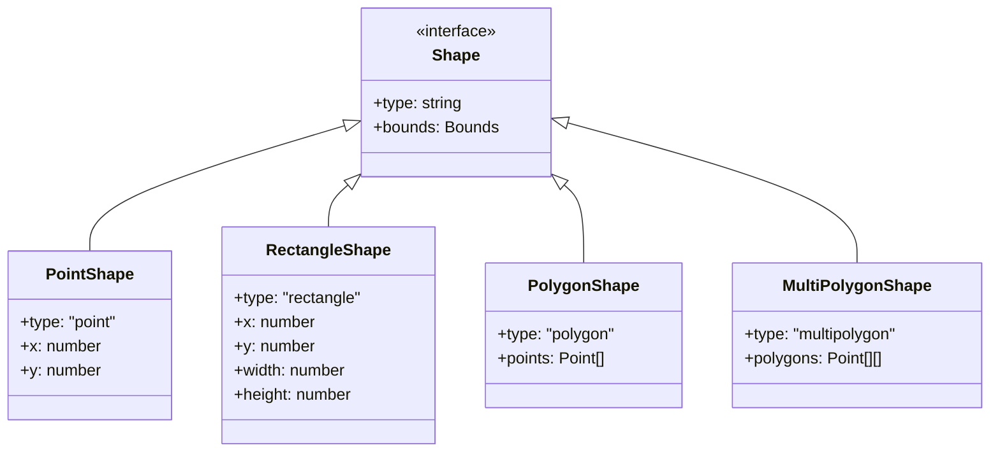

### Style Expression System

Annota supports both static and dynamic styling:

```typescript
// Static style - same for all annotations
const staticStyle: AnnotationStyle = {
  fill: '#FF0000',
  fillOpacity: 0.3,
  stroke: '#FFFFFF',
  strokeWidth: 2,
};

// Dynamic style - computed per annotation
const dynamicStyle: StyleExpression = (annotation, state) => ({
  fill: annotation.properties?.type === 'tumor' ? '#FF0000' : '#00FF00',
  fillOpacity: state.hover ? 0.6 : 0.3,
  stroke: state.selected ? '#FFFF00' : '#FFFFFF',
  strokeWidth: state.selected ? 4 : 2,
});
```

## Tool System

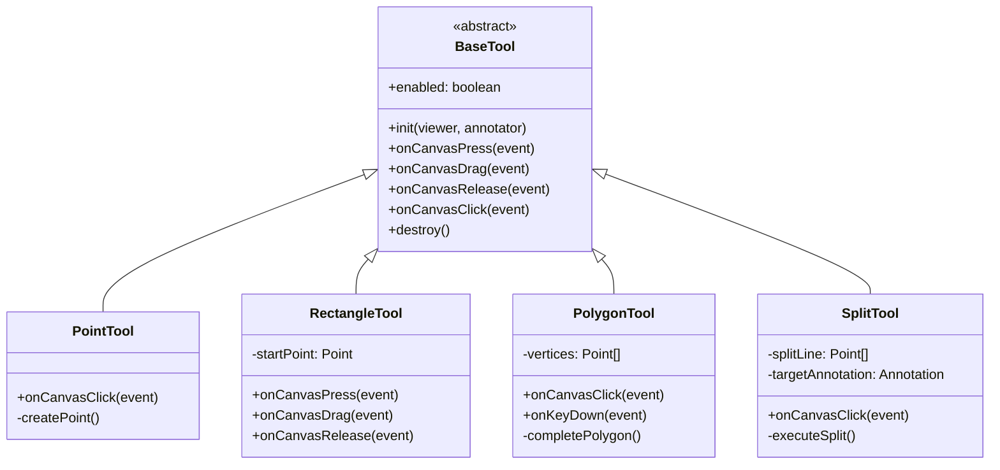

### Tool Lifecycle

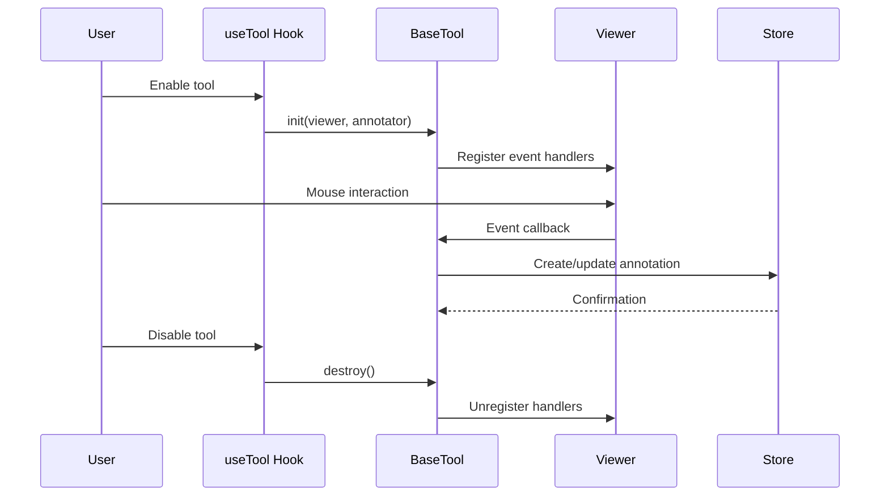

## Inspired by Annotorious

Annota's architecture incorporates lessons from [Annotorious v3](https://annotorious.dev):

### 1. Multi-Layer Rendering

<Callout type="info">
Instead of a monolithic overlay, separate concerns into specialized layers.
</Callout>

- **PixiLayer**: Display layer using WebGL for performance
- **SVGDrawingLayer**: Interactive drawing tools with precise vector control
- **SVGSelectionLayer**: Selection highlighting and handles

### 2. Observable State Pattern

```typescript
const state = {
  store: createStore<Annotation>(),      // Annotation data
  hover: createHoverState(),             // Hover tracking
  selection: createSelectionState(),     // Selection tracking
  viewport: createViewportState(),       // Viewport state
};
```

**Key Insight**: Layers observe and react to state changes - they don't manage state themselves.

### 3. Thin React Wrapper

The React layer doesn't implement annotation logic - it's purely a bridge:

```tsx
// React just provides convenient access
function MyComponent() {
  const annotations = useAnnotations();  // Observes store
  const annotator = useAnnotator();      // Access to core API

  // Core logic lives in annotator, not React
  return <button onClick={() => annotator.addAnnotation(...)}>Add</button>;
}
```

## Extension Points

<Steps>

### Custom Loaders
Implement the loader interface to support new annotation formats:

```typescript
interface AnnotationLoader {
  load(source: any): Promise<Annotation[]>;
  save(annotations: Annotation[]): Promise<Blob>;
}
```

### Custom Renderers
Replace PixiJS with Canvas2D, SVG, or other rendering backends by implementing the renderer interface.

### Custom Adapters
Support other viewers (Leaflet, OpenLayers, custom WebGL viewers) by creating an adapter.

### Custom Tools
Extend `BaseTool` to create new annotation interaction patterns.

### Styling Functions
Implement dynamic styling based on annotation properties, external state, or user preferences.

</Steps>

## Performance Benchmarks

<Callout type="success">
Annota is designed to handle **10,000+ annotations at 60 FPS** on modern hardware.
</Callout>

| Operation | Without Optimization | With Optimization |
|-----------|---------------------|-------------------|
| Hover detection (10k annotations) | ~10ms (100 FPS) | ~0.1ms (10000 FPS) |
| Render all (10k annotations) | ~50ms (20 FPS) | ~8ms (120 FPS) |
| Viewport pan/zoom | Laggy | Smooth 60 FPS |

**Key Optimizations**:
1. R-tree spatial indexing: O(n) → O(log n) for spatial queries
2. Viewport culling: Render ~100 visible instead of 10,000 total
3. WebGL rendering: Hardware acceleration via PixiJS
4. Observable pattern: Granular updates, no full re-renders

## Best Practices

### 1. Use Spatial Queries

```typescript
// ❌ Bad - iterates all annotations
const annotations = annotator.getAnnotations();
const nearby = annotations.filter(ann => isNear(point, ann));

// ✅ Good - uses R-tree spatial index
const nearby = annotator.getAnnotationsAt(point, radius);
```

### 2. Batch Operations

```typescript
// ❌ Bad - triggers N observer notifications
annotations.forEach(ann => store.add(ann));

// ✅ Good - triggers 1 observer notification
store.addAll(annotations);
```

### 3. Layer Organization

```typescript
// ✅ Organize by semantic meaning
const layers = {
  tumor: { visible: true, opacity: 0.5 },
  stroma: { visible: true, opacity: 0.3 },
  background: { visible: false },
  annotations: { visible: true, locked: false },
};
```

### 4. Style Performance

```typescript
// ❌ Bad - complex computation on every render
const style = (ann) => {
  const result = heavyComputation(ann.properties);
  return { fill: result.color };
};

// ✅ Good - compute once, memoize if needed
const colorMap = computeColorMap(annotations);
const style = (ann) => ({ fill: colorMap[ann.id] });
```

## Public API Surface

```typescript
// Core - Framework-agnostic
export { createAnnotationStore, createLayerManager, createHistory } from './core';
export type { Annotation, AnnotationStyle, Shape } from './core/types';

// Operations
export { mergeAnnotations, splitAnnotation, canMergeAnnotations, canSplitAnnotation } from './core/operations';

// Adapters
export { createOpenSeadragonAnnotator } from './adapters/openseadragon';

// Tools
export { PointTool, RectangleTool, PolygonTool, PushTool, SplitTool, ContourTool } from './tools';

// React Integration
export { AnnotaProvider, AnnotaViewer, Annotator } from './react';
export { useAnnotator, useAnnotations, useAnnotation, useSelection, useTool } from './react/hooks';

// Loaders
export { loadH5Annotations } from './loaders/h5';
export { loadPGMFile, annotationsToPGM } from './loaders/pgm';
```

## Next Steps

- **[Getting Started](/docs/getting-started)** - Install and create your first annotation app
- **[Core Concepts](/docs/guides/core-concepts)** - Understand annotations, layers, and state
- **[Performance Guide](/docs/guides/performance)** - Optimize for large datasets
- **[API Reference](/api)** - Complete API documentation
