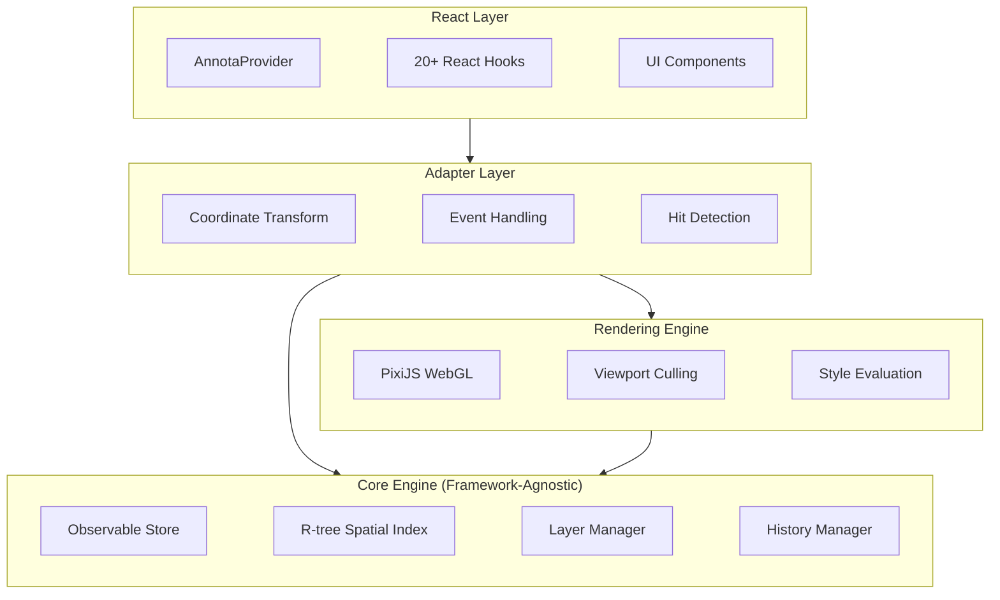
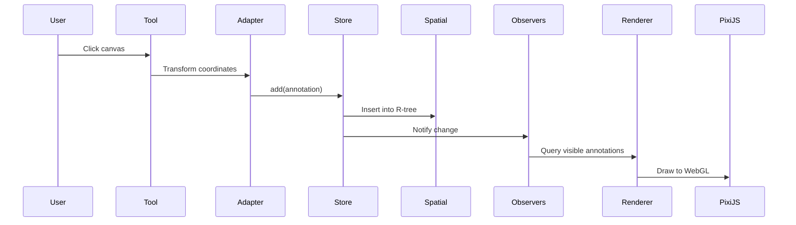
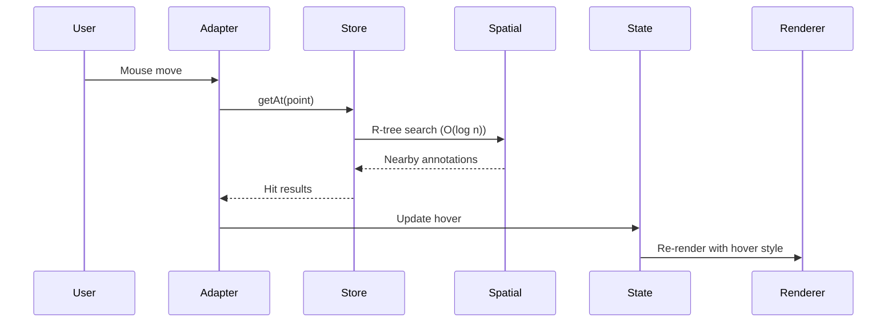
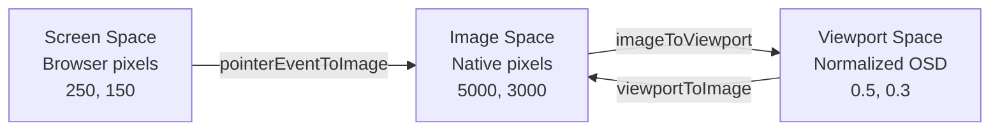

# Architecture

import { Callout } from 'nextra/components'

Annota follows a clean, layered architecture designed for **performance at scale** and **framework independence**.

## System Overview



<Callout>
The architecture separates concerns into **four independent layers**. The core engine has zero framework dependencies, making it reusable across React, Vue, Svelte, or vanilla JS.
</Callout>

## Layer Responsibilities

### Core Engine (Framework-Agnostic)

Pure TypeScript with no external dependencies. Handles all business logic:

- **Observable Store**: CRUD operations, spatial indexing, change notifications
- **R-tree Spatial Index**: O(log n) queries for 10,000+ annotations
- **Layer Manager**: Per-layer visibility, opacity, locking, filtering
- **History Manager**: Undo/redo with command pattern (create, update, delete, split, merge)
- **Selection Manager**: Multi-selection state

**Why separate?** Business logic should be testable and reusable without coupling to UI frameworks or rendering engines.

### Rendering Engine

Subscribes to core store changes and renders annotations using PixiJS WebGL:

- **Viewport Culling**: Spatial query for visible annotations only (~100 of 10,000)
- **Style Evaluation**: Compute static/dynamic styles before rendering
- **WebGL Acceleration**: Hardware-accelerated graphics via PixiJS
- **LOD System**: Level-of-detail simplification at low zoom

**Why separate?** Decoupling rendering allows swapping PixiJS for Canvas2D or SVG without touching business logic.

### Adapter Layer

Bridges OpenSeadragon viewer with the core engine:

- **Coordinate Transforms**: Screen space ↔ Image space conversions
- **Event Handling**: Mouse/touch events → annotation operations
- **Hit Detection**: Spatial queries for hover/click interactions

**Why separate?** Different viewers (Leaflet, OpenLayers) have different APIs. Adapters isolate these differences.

### React Layer

Thin wrapper providing React-friendly access to core APIs:

- **Hooks**: `useAnnotations()`, `useSelection()`, `useTool()` subscribe to store changes
- **Components**: `<AnnotaViewer>`, `<Annotator>`, `<AnnotationPopup>`
- **Context**: `AnnotaProvider` for dependency injection

**Why separate?** React is just one possible UI binding. Core logic lives in framework-agnostic modules.

## Data Flow

### Creating an Annotation



### Querying Annotations (Hover/Click)



## Performance Strategy

### The Problem

Naive approaches fail at scale:
- **Hover detection**: Iterating 10,000 annotations on every mouse move = 10,000 checks
- **Rendering**: Drawing all 10,000 annotations on every frame = 10,000 draw calls

### The Solution

Four key optimizations enable 60 FPS with 10,000+ annotations:

1. **R-tree Spatial Index**: O(log n) queries (~13 checks instead of 10,000)
2. **Viewport Culling**: Only render visible annotations (~100 typical)
3. **WebGL Rendering**: Hardware-accelerated batch rendering via PixiJS
4. **Observable Pattern**: Granular updates, no full re-renders

**Result**: Constant-time performance regardless of total annotation count.

## Coordinate Systems

Three coordinate spaces exist throughout the system:



- **Image Space**: Native pixel coordinates (what's stored in annotations)
- **Viewport Space**: OpenSeadragon's normalized coordinates (0-1 range)
- **Screen Space**: Browser pixel coordinates (where mouse events occur)

<Callout type="warning">
**Critical**: Annotations are always stored in **image space** (zoom-independent). Events arrive in **screen space** and must be transformed via the adapter.
</Callout>

## Design Principles

### Framework-Agnostic Core

The core engine is pure TypeScript with zero dependencies on React, OpenSeadragon, or PixiJS.

**Benefits**:
- Reuse logic across React, Vue, Svelte, vanilla JS
- Swap rendering backends (PixiJS → Canvas2D → SVG)
- Integrate with different viewers (OpenSeadragon → Leaflet → OpenLayers)

### Observable Pattern

State is managed in observable stores. Components and renderers subscribe to changes:

```typescript
store.observe((event) => {
  // React hooks re-render
  // PixiJS renderer updates
  // Tools respond to state
});
```

**Benefits**: Decoupled state management—no prop drilling, no Redux, no context pollution.

### Single Responsibility

Each layer has one job:
- **Core**: Manage annotation data
- **Rendering**: Draw to screen
- **Adapter**: Bridge viewer framework
- **React**: Provide UI bindings

**Benefits**: Easy to test, maintain, and extend. Swap any layer without affecting others.
