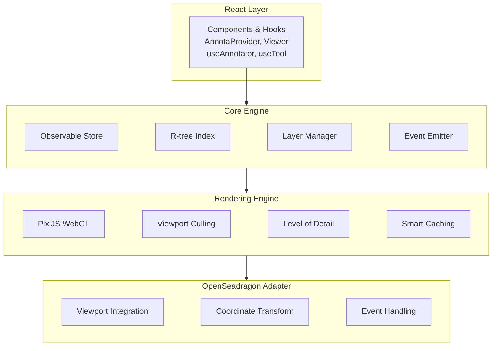

import { Cards, Callout, Steps } from "nextra/components";

# Introduction

Annota is a **high-performance annotation framework** designed specifically for whole slide imaging (WSI) and digital pathology applications. Built with TypeScript and React, it provides a comprehensive solution for creating, editing, and managing annotations on large-scale medical images.

<Callout type="info">
  **Performance at Scale**: Annota handles over 10,000 annotations at 60 FPS
  with hardware-accelerated rendering, viewport culling, and R-tree spatial
  indexing.
</Callout>

## Why Annota?

<Cards num={3}>
  <Cards.Card title="⚡ High Performance" href="/docs/guides/tools">
    Hardware-accelerated PixiJS rendering with viewport culling and
    level-of-detail optimization for smooth interaction with thousands of
    annotations.
  </Cards.Card>
  <Cards.Card title="🎨 Purpose-Built for Pathology" href="/docs/guides/tools">
    Specialized tools for medical imaging: point markers, rectangles, polygons,
    contour detection, and push/pull editing.
  </Cards.Card>
  <Cards.Card title="🔌 Event-Driven" href="/docs/guides/events">
    Comprehensive event system for annotation lifecycle: create, update, delete,
    and selection changes.
  </Cards.Card>
  <Cards.Card title="📦 Multi-Layer Organization" href="/docs/guides/layers">
    Organize annotations into layers with independent visibility, opacity,
    locking, and z-index controls.
  </Cards.Card>
  <Cards.Card title="💾 Flexible Data Loading" href="/docs/guides/loaders">
    Built-in loaders for H5 masks, H5 coordinates, JSON, and PGM formats with
    error handling.
  </Cards.Card>
  <Cards.Card title="⚛️ React First" href="/api/hooks">
    Modern hooks API, TypeScript support, and pre-built components for rapid
    development.
  </Cards.Card>
</Cards>

## Quick Start

<Steps>

### Install Annota

```bash
npm install annota openseadragon
# or
pnpm add annota openseadragon
```

### Create Your First Viewer

```tsx
import { AnnotaProvider, AnnotaViewer, Annotator } from "annota";
import { useState } from "react";
import "annota/dist/index.css";

function App() {
  const [viewer, setViewer] = useState(null);

  return (
    <AnnotaProvider slideId="slide-001">
      <div style={{ width: "100vw", height: "100vh" }}>
        <AnnotaViewer
          options={{
            tileSources: "/path/to/image.dzi",
            prefixUrl:
              "https://cdn.jsdelivr.net/npm/openseadragon@4/build/openseadragon/images/",
          }}
          onViewerReady={setViewer}
        />
        <Annotator viewer={viewer} />
      </div>
    </AnnotaProvider>
  );
}
```

### Add Annotation Tools

```tsx
import { useTool, PointTool, PolygonTool } from "annota";

const pointTool = new PointTool();
const polygonTool = new PolygonTool();

useTool({ viewer, handler: pointTool, enabled: true });
```

</Steps>

<Callout type="success">
  **Ready to go!** You now have a working annotation viewer. [See full examples
  →](/docs/examples/basic-viewer)
</Callout>

## Key Features

### Performance

Annota is optimized for large-scale medical imaging with advanced rendering techniques:

- **🚀 Viewport Culling**: Only renders annotations visible in the current viewport
- **📊 Level of Detail (LOD)**: Automatically simplifies rendering when zoomed out
- **💾 Smart Caching**: Graphics only re-rendered when state, LOD, or scale changes significantly
- **🌳 R-tree Spatial Indexing**: Sub-millisecond hit testing and spatial queries
- **⚡ Hardware Acceleration**: PixiJS WebGL rendering for 60 FPS performance

<Callout type="info">
  **Performance Metrics**: Handles over 10,000 annotations smoothly with 60 FPS
  during pan/zoom operations.
</Callout>

### Annotation Tools

Comprehensive set of tools for medical image annotation:

| Tool              | Purpose                         | Interaction                            |
| ----------------- | ------------------------------- | -------------------------------------- |
| **PointTool**     | Cell counting, nuclei detection | Single click                           |
| **RectangleTool** | Bounding boxes, ROI selection   | Click and drag                         |
| **PolygonTool**   | Tumor boundaries, segmentation  | Click vertices, double-click to finish |
| **PushTool**      | Refine polygon boundaries       | Click and drag to push/pull vertices   |
| **ContourTool**   | Automatic contour detection     | Click to detect from masks             |

[Learn more about tools →](/docs/guides/tools)

### Event System

React to annotation changes with a comprehensive event system:

```tsx
annotator.on("createAnnotation", (annotation) => {
  console.log("Annotation created:", annotation);
});

annotator.on("updateAnnotation", (annotation) => {
  console.log("Annotation updated:", annotation);
});

annotator.on("deleteAnnotation", (annotation) => {
  console.log("Annotation deleted:", annotation);
});

annotator.on("selectionChanged", ({ selected }) => {
  console.log("Selection changed:", selected);
});
```

[Explore event handling →](/docs/guides/events)

### Layer System

Organize annotations into multiple layers with independent controls:

- **Visibility**: Toggle layer visibility on/off
- **Opacity**: Adjust layer transparency (0-1)
- **Locking**: Prevent editing of specific layers
- **Z-Index**: Control rendering order
- **Per-Layer Styling**: Apply consistent styles across layers

[Master layer management →](/docs/guides/layers)

### Data Loaders

Import annotations from various file formats:

```tsx
// Load H5 mask annotations
const maskAnnotations = await loadH5Masks("/annotations/masks.h5", {
  color: "#FF0000",
  fillOpacity: 0.3,
});

// Load H5 point coordinates
const pointAnnotations = await loadH5Coordinates("/annotations/cells.h5", {
  color: "#00FF00",
  fillOpacity: 0.8,
});
```

**Supported formats**: H5 masks, H5 coordinates, JSON, PGM

[Data loading guide →](/docs/guides/loaders)

### React Integration

Modern React hooks for seamless integration:

```tsx
import {
  useAnnotations, // Get all annotations
  useAnnotation, // Get specific annotation
  useSelection, // Access selected annotations
  useTool, // Activate annotation tool
  useLayerManager, // Manage layers
  useAnnotator, // Access annotator instance
} from "annota";
```

Full TypeScript support with comprehensive type definitions.

[Explore React hooks →](/api/hooks)

## Architecture

Annota follows a clean, layered architecture separating concerns:



<Callout>
  The architecture separates concerns into four distinct layers, each with
  specific responsibilities. This design enables high performance,
  maintainability, and extensibility.
</Callout>

[Learn more about the architecture →](/docs/architecture)

## Use Cases

<Cards num={3}>
  <Cards.Card title="🔬 Digital Pathology" href="/docs/guides/tools">
    Annotate regions of interest in whole slide images for diagnosis and
    research.
  </Cards.Card>
  <Cards.Card title="🤖 AI Training" href="/docs/guides/loaders">
    Create and manage training datasets for machine learning models in medical
    imaging.
  </Cards.Card>
  <Cards.Card title="🏥 Clinical Workflows" href="/docs/examples/basic-viewer">
    Support pathologist workflows with professional annotation tools and
    collaborative features.
  </Cards.Card>
  <Cards.Card title="📊 Research" href="/docs/guides/events">
    Facilitate medical imaging research with flexible annotation capabilities
    and data export.
  </Cards.Card>
  <Cards.Card title="🔢 Cell Counting" href="/docs/guides/tools">
    Mark and count cells, nuclei, or other features with point annotations.
  </Cards.Card>
  <Cards.Card title="🎯 Tumor Segmentation" href="/docs/guides/tools">
    Trace tumor boundaries and create segmentation masks with polygon tools.
  </Cards.Card>
</Cards>

## Next Steps

<Cards num={3}>
  <Cards.Card title="📖 Getting Started" href="/docs/getting-started">
    Install Annota and build your first annotation viewer in minutes.
  </Cards.Card>
  <Cards.Card title="🎓 Guides" href="/docs/guides/tools">
    Learn how to use annotation tools, layers, events, and styling.
  </Cards.Card>
  <Cards.Card title="📚 API Reference" href="/api">
    Explore the complete API documentation with TypeScript types.
  </Cards.Card>
  <Cards.Card title="💡 Examples" href="/docs/examples/basic-viewer">
    See practical examples and copy-paste ready code.
  </Cards.Card>
  <Cards.Card title="🎮 Playground" href="/playground">
    Try Annota in an interactive environment with sample images.
  </Cards.Card>
  <Cards.Card title="🏗️ Architecture" href="/docs/architecture">
    Understand the framework design and implementation details.
  </Cards.Card>
</Cards>

<Callout type="warning">
  **Need Help?** Check out our [GitHub
  repository](https://github.com/bitroc-ai/annota) or open an
  [issue](https://github.com/bitroc-ai/annota/issues) for support.
</Callout>
