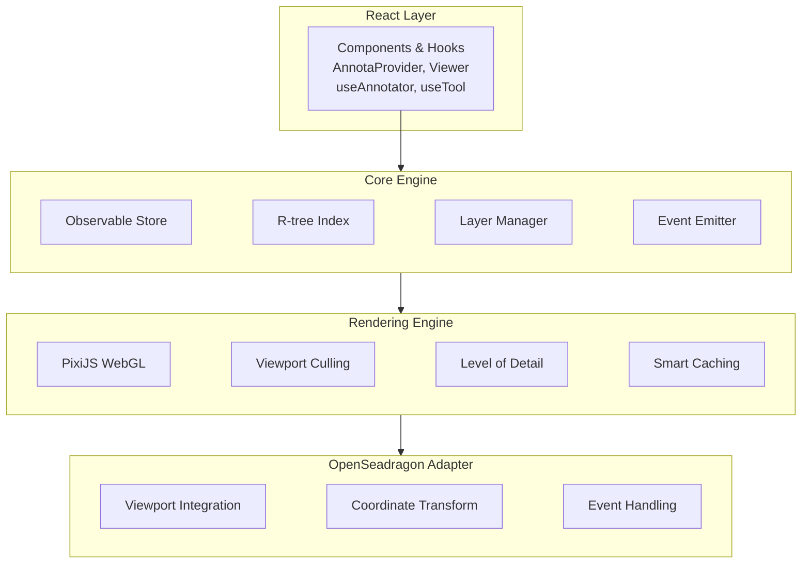

import Cards from '../../lib/components/md/Cards.astro';
import Callout from '../../lib/components/md/Callout.astro';
import Steps from '../../lib/components/md/Steps.astro';
import Card from '../../lib/components/md/Card.astro';
import Tabs from '../../lib/components/md/Tabs.astro';
import Tab from '../../lib/components/md/Tab.astro';
import {
  Zap,
  Palette,
  Plug,
  Layers,
  Database,
  Atom,
  BookOpen,
  GraduationCap,
  FileText,
  Lightbulb,
  Gamepad2,
  Building,
} from 'lucide-svelte';
import ExampleViewer from '../../lib/components/examples/ExampleViewer.astro';

# Introduction

Annota is a **high-performance annotation framework** designed specifically for whole slide imaging (WSI) and digital pathology applications. Built with TypeScript, it provides a comprehensive solution for creating, editing, and managing annotations on large-scale medical images. Available for both **Svelte** and **React** applications.

<Callout type="info">
  **Performance at Scale**: Annota handles over 10,000 annotations at 60 FPS
  with hardware-accelerated rendering, viewport culling, and R-tree spatial
  indexing.
</Callout>

## Why Annota?

<Cards num={3}>
  <Card iconName="Zap" title="High Performance" href="/docs/guides/tools" />
  <Card
    iconName="Palette"
    title="Purpose-Built for Pathology"
    href="/docs/guides/tools"
  />
  <Card
    iconName="Plug"
    title="Event-Driven Architecture"
    href="/docs/guides/events"
  />
  <Card
    iconName="Layers"
    title="Multi-Layer Organization"
    href="/docs/guides/layers"
  />
  <Card
    iconName="Database"
    title="Flexible Data Loading"
    href="/docs/guides/loaders"
  />
  <Card iconName="Atom" title="Svelte & React" href="/api/hooks" />
</Cards>

## Try It Now

**Interactive Demo**: Click and drag to draw a rectangle annotation, or select and resize the existing one.

<ExampleViewer type="rectangle" height={500} />

<Callout>
  This is a fully interactive annotation viewer. You can create, select, move,
  and resize annotations in real-time. The same viewer powers production
  pathology workflows.
</Callout>

## Quick Start

<Steps>

### Install Annota

<Tabs items={["npm", "pnpm", "yarn"]}>
  <Tab>
    ```bash
    npm install annota openseadragon
    ```
  </Tab>
  <Tab>
    ```bash
    pnpm add annota openseadragon
    ```
  </Tab>
  <Tab>
    ```bash
    yarn add annota openseadragon
    ```
  </Tab>
</Tabs>

### Create Your First Viewer

<Tabs items={["Svelte", "React"]}>
  <Tab>
    ```svelte
    <script lang="ts">
      import { AnnotaProvider, Viewer as AnnotaViewer, Annotator } from "annota/svelte";
      import OpenSeadragon from "openseadragon";
      import "annota/dist/index.css";

      let viewer: OpenSeadragon.Viewer | undefined = $state(undefined);
    </script>

    <AnnotaProvider slideId="slide-001">
      <div style="width: 100vw; height: 100vh;">
        <AnnotaViewer
          options={{
            tileSources: "/path/to/image.dzi",
            prefixUrl:
              "https://cdn.jsdelivr.net/npm/openseadragon@4/build/openseadragon/images/",
          }}
          onViewerReady={(v) => viewer = v}
        />
        <Annotator viewer={viewer} />
      </div>
    </AnnotaProvider>
    ```
  </Tab>
  <Tab>
    ```tsx
    import { AnnotaProvider, AnnotaViewer, Annotator } from "annota";
    import { useState } from "react";
    import "annota/dist/index.css";

    function App() {
      const [viewer, setViewer] = useState(null);

      return (
        <AnnotaProvider slideId="slide-001">
          <div style={{ width: "100vw", height: "100vh" }}>
            <AnnotaViewer
              options={{
                tileSources: "/path/to/image.dzi",
                prefixUrl:
                  "https://cdn.jsdelivr.net/npm/openseadragon@4/build/openseadragon/images/",
              }}
              onViewerReady={setViewer}
            />
            <Annotator viewer={viewer} />
          </div>
        </AnnotaProvider>
      );
    }
    ```
  </Tab>
</Tabs>

### Add Annotation Tools

<Tabs items={["Svelte", "React"]}>
  <Tab>
    ```svelte
    <script lang="ts">
      import { tool } from "annota/svelte";
      import { PointTool, PolygonTool } from "annota";

      const pointTool = new PointTool();
      const polygonTool = new PolygonTool();

      tool({ viewer: () => viewer, handler: () => pointTool, enabled: () => true });
    </script>
    ```
  </Tab>
  <Tab>
    ```tsx
    import { useTool } from "annota";
    import { PointTool, PolygonTool } from "annota";

    function MyComponent() {
      const pointTool = new PointTool();
      useTool(viewer, pointTool);
      
      // Or switch tools dynamically
      const polygonTool = new PolygonTool();
      useTool(viewer, polygonTool);
    }
    ```
  </Tab>
</Tabs>

</Steps>

<Callout type="success">
  **Ready to go!** You now have a working annotation viewer. [See full examples
  →](/docs/use-cases/basic-viewer)
</Callout>

## Key Features

### Performance

Annota is optimized for large-scale medical imaging with advanced rendering techniques:

- **🚀 Viewport Culling**: Only renders annotations visible in the current viewport
- **📊 Level of Detail (LOD)**: Automatically simplifies rendering when zoomed out
- **💾 Smart Caching**: Graphics only re-rendered when state, LOD, or scale changes significantly
- **🌳 R-tree Spatial Indexing**: Sub-millisecond hit testing and spatial queries
- **⚡ Hardware Acceleration**: PixiJS WebGL rendering for 60 FPS performance

<Callout type="info">
  **Performance Metrics**: Handles over 10,000 annotations smoothly with 60 FPS
  during pan/zoom operations.
</Callout>

### Annotation Tools

Comprehensive set of tools for medical image annotation:

| Tool              | Purpose                         | Interaction                            |
| ----------------- | ------------------------------- | -------------------------------------- |
| **PointTool**     | Cell counting, nuclei detection | Single click                           |
| **RectangleTool** | Bounding boxes, ROI selection   | Click and drag                         |
| **PolygonTool**   | Tumor boundaries, segmentation  | Click vertices, double-click to finish |
| **PushTool**      | Refine polygon boundaries       | Click and drag to push/pull vertices   |
| **ContourTool**   | Automatic contour detection     | Click to detect from masks             |

[Learn more about tools →](/docs/guides/tools)

### Event System

React to annotation changes with a comprehensive event system:

```tsx
annotator.on("createAnnotation", (annotation) => {
  console.log("Annotation created:", annotation);
});

annotator.on("updateAnnotation", (annotation) => {
  console.log("Annotation updated:", annotation);
});

annotator.on("deleteAnnotation", (annotation) => {
  console.log("Annotation deleted:", annotation);
});

annotator.on("selectionChanged", ({ selected }) => {
  console.log("Selection changed:", selected);
});
```

[Explore event handling →](/docs/guides/events)

### Layer System

Organize annotations into multiple layers with independent controls:

- **Visibility**: Toggle layer visibility on/off
- **Opacity**: Adjust layer transparency (0-1)
- **Locking**: Prevent editing of specific layers
- **Z-Index**: Control rendering order
- **Per-Layer Styling**: Apply consistent styles across layers

[Master layer management →](/docs/guides/layers)

### Data Loaders

Import annotations from various file formats:

```tsx
// Load H5 mask annotations
const maskAnnotations = await loadH5Masks("/annotations/masks.h5", {
  color: "#FF0000",
  fillOpacity: 0.3,
});

// Load H5 point coordinates
const pointAnnotations = await loadH5Coordinates("/annotations/cells.h5", {
  color: "#00FF00",
  fillOpacity: 0.8,
});
```

**Supported formats**: H5 masks, H5 coordinates, JSON, PGM

[Data loading guide →](/docs/guides/loaders)

### Svelte Integration

Modern Svelte functions with runes for seamless integration:

```svelte
<script lang="ts">
  import {
    annotations, // Get all annotations reactively
    selection, // Access selected annotations
    tool, // Activate annotation tool
    layerManager, // Manage layers
    getAnnotator, // Access annotator instance
  } from "annota/svelte";
</script>
```

### React Integration

Modern React hooks for seamless integration:

```tsx
import {
  useAnnotations, // Get all annotations
  useAnnotation, // Get specific annotation
  useSelection, // Access selected annotations
  useTool, // Activate annotation tool
  useLayerManager, // Manage layers
  useAnnotator, // Access annotator instance
} from "annota";
```

Full TypeScript support with comprehensive type definitions.

[Explore Svelte functions →](/api/hooks) | [Explore React hooks →](/api/hooks)

## Architecture

Annota follows a clean, layered architecture separating concerns:



<Callout>
  The architecture separates concerns into four distinct layers, each with
  specific responsibilities. This design enables high performance,
  maintainability, and extensibility.
</Callout>

[Learn more about the architecture →](/docs/architecture)

## Next Steps

<Cards num={3}>
  <Card iconName="BookOpen" title="Getting Started" href="/docs/getting-started" />
  <Card iconName="GraduationCap" title="Guides" href="/docs/guides/tools" />
  <Card iconName="FileText" title="API" href="/api" />
  <Card
    iconName="Lightbulb"
    title="Use Cases"
    href="/docs/use-cases/basic-viewer"
  />
  <Card iconName="Gamepad2" title="Playground" href="/playground" />
  <Card iconName="Building" title="Architecture" href="/docs/architecture" />
</Cards>

<Callout type="warning">
  **Need Help?** Check out our [GitHub
  repository](https://github.com/bitroc-ai/annota) or open an
  [issue](https://github.com/bitroc-ai/annota/issues) for support.
</Callout>
